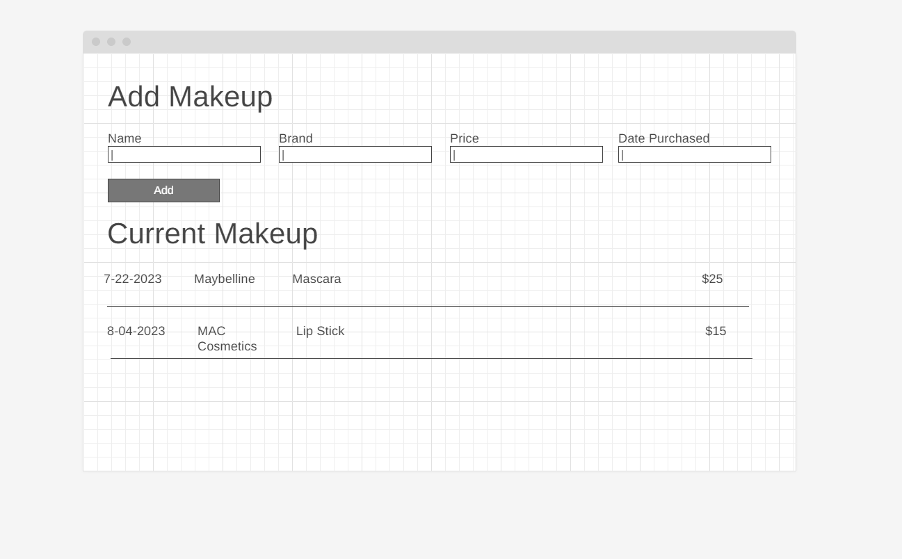

# Makeup List

Build a makeup list with postgres and [the node `pg` module](https://node-postgres.com/)

---

To spin up this project:

```sh
npm install
npm install pg
npm start
```

If you don't already have a `makeup` database, create one using Postico and run the SQL from [database.sql](./database.sql).

Weekend Challenge: JavaScript Makeup Inventory List

Create an application that manages your makeup inventory by recording makeup products and their details.

NOTE: We are expecting a minimum of 8 commits for this assignment.

Topics Covered
JavaScript
Selectors, appending to the DOM, and event handling
HTML Forms

# Assignment
The application should use the stored information in the database, and should display the entire list of products on initial page load.

The application should have a form that collects makeup product details including product name, brand, price, and date purchased.
A 'Submit' button should collect the form information, store the information in the database, append the product information to the DOM, and clear the input fields.

Create a delete button for each makeup product that removes the product from the DOM. For Base mode, it does not need to remove that product's details from the stored information.

Additionally, add a feature that calculates and displays the total value of all makeup products in your inventory. If the total value exceeds a certain threshold, for example, $500, highlight the total value in red.

# Wireframe / Basic Design
